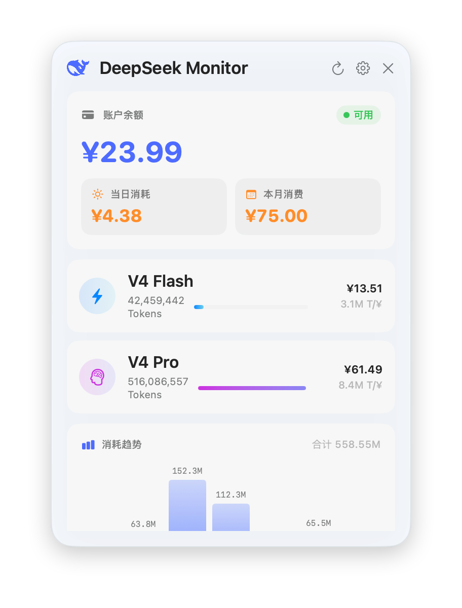
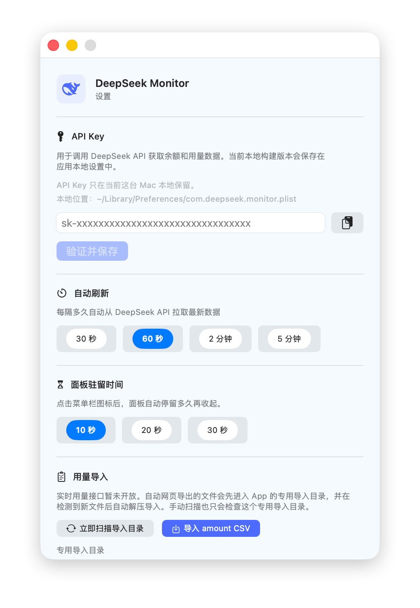

# DeepSeek Monitor

<p align="center">
  <strong>原生 macOS 菜单栏工具，实时监控 DeepSeek API 用量与消费</strong>
</p>

<p align="center">
  
  
  
  
</p>

<p align="center">
  
  <br />
  <em>主面板：余额、模型用量、7 日消耗趋势</em>
</p>

## 特性

- **余额监控** — 实时展示账户总余额和当月消费金额
- **Token 用量** — 按模型（V4 Flash / V4 Pro）统计 Token 消耗与费用
- **使用趋势** — 近 7 天每日 Token 消耗柱状图
- **用量导入** — 支持手动或自动导入 DeepSeek 平台导出的 CSV / ZIP
- **自动导出** — 内置 WKWebView 自动登录 DeepSeek 平台，一键触发用量导出
- **本地缓存** — 重启 App 即时显示上次数据，不白屏

<p align="center">
  
  <br />
  <em>设置面板：API Key 配置、刷新间隔、用量导入、缓存管理</em>
</p>

## 安装

### 下载安装

从 [GitHub Releases](https://github.com/JayHome137/DeepSeekMonitor/releases) 下载最新 DMG，将 App 拖入 Applications 文件夹。

### 源码构建

```bash
git clone https://github.com/JayHome137/DeepSeekMonitor.git
cd DeepSeekMonitor

# 编译并运行
./build.sh restart

# 打包 DMG
./build.sh dmg
```

## 使用

1. 点击菜单栏图标 → 右键 **设置**
2. 输入 [DeepSeek API Key](https://platform.deepseek.com/api_keys)
3. 点击 **验证并保存**
4. 面板自动展示余额和用量数据

若用量接口不可用，可通过「设置 → 用量导入」，从 [DeepSeek Usage 页面](https://platform.deepseek.com/usage) 导出 CSV 手动导入。

## 技术栈

| 层次 | 技术 |
|---|---|
| 语言 | Swift 5.9+ |
| UI | SwiftUI + AppKit（NSStatusBar / NSWindow / NSPanel） |
| 网络 | URLSession — DeepSeek API |
| 自动化 | WKWebView + JavaScript 注入 |
| 状态管理 | Combine / ObservableObject / @Published |
| 存储 | UserDefaults（LocalCache + API Key 降级） |
| 文件监控 | DispatchSourceFileSystemObject |
| 构建 | Swift Package Manager + Shell 脚本 |

## 系统要求

- macOS 14 Sonoma 及以上
- Apple Silicon
- [DeepSeek API Key](https://platform.deepseek.com/api_keys)

## 隐私

所有数据仅存储在本地 Mac 上，不会上传至任何第三方服务。

- API Key 存储在 `~/Library/Preferences/com.deepseek.monitor.plist`（UserDefaults）
- 导入的用量 CSV/ZIP 文件仅本地处理，缓存数据用于重启后恢复显示
- 网络请求仅访问 `api.deepseek.com`（余额/用量查询）和 `platform.deepseek.com`（用户主动触发的自动导出）
- 无任何埋点、遥测或第三方追踪

## 许可证

MIT
